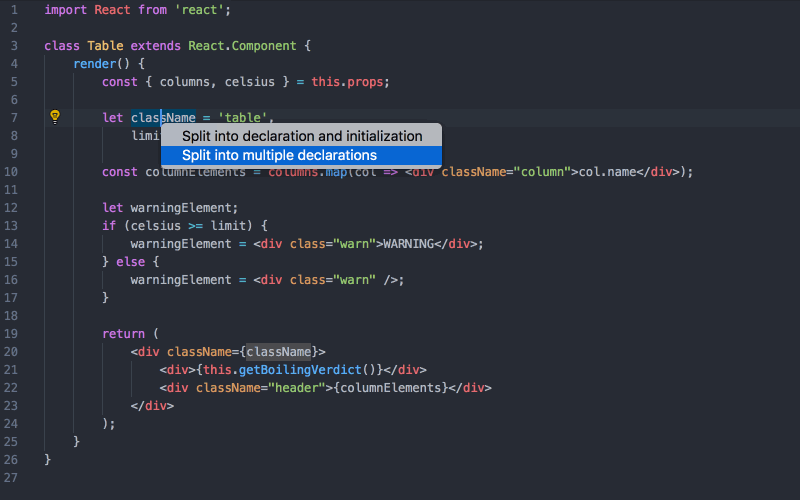

# VS Code JavaScript Booster [](https://travis-ci.org/xsburg/vscode-javascript-booster)

Make your life easier, use code actions to do repetitive tasks for you! They can help a lot, just follow the light bulb [💡]!

This VS Code extension provides various code actions (quick fixes) when editing code in JavaScript (or TypeScript/Flow). Just note the light bulb at the left and press it to learn how you can transform the code under the cursor.

You might want to reassign the default shortcut for the quick fix menu to `Alt+Enter` if you are moving from WebStorm. Search for `editor.action.quickFix` command.



## Installation

Install through VS Code extensions. Search for `JavaScript Booster`

[Visual Studio Code Market Place: JavaScript Booster](https://marketplace.visualstudio.com/items?itemName=sburg.vscode-javascript-booster)

Can also be installed using

```
ext install vscode-javascript-booster
```

## Supported code actions

* 💥 Flip if-else
* 💥 Remove redundant else
* 💥 Replace if-else with ?:
* 💥 Convert shorthand arrow function to statement
* 💥 Convert to shorthand arrow function
* 💥 Replace string with template string
* 💥 Replace template string with regular string
* 💥 Wrap value with {} (JSX attributes)
* 💥 Convert var to let
* 💥 Convert var to const
* 💥 Split into multiple declarations
* 💥 Split into declaration and initialisation
* 💥 Merge declaration and initialisation

## Roadmap

### More code actions

* Flip ?:
* Convert if-else-return -> return ?:
* JSX: Collapse/Expand empty tag
* TS: Convert alias to interface
* ...?

### New commands

* Extend/Shrink selection (similar to what WebStorm provides)
* Duplicate line/selection
* Navigate to related files (Hello.jsx -> Hello.scss, Hello.spec.jsx)

### Others

* Support loading code actions from user workspace: users can create their own, project-related refactorings! 😅

## Inspiration

Largely inspired by [WebStorm](https://www.jetbrains.com/webstorm) and its variety of code refactorings. The extension uses [Babylon](https://github.com/babel/babel/tree/master/packages/babylon) to parse the code and then manipulates the abstract syntax tree using [jscodeshift](https://github.com/facebook/jscodeshift).

<!-- ## Extension Settings

Include if your extension adds any VS Code settings through the `contributes.configuration` extension point.

For example:

This extension contributes the following settings:

* `myExtension.enable`: enable/disable this extension
* `myExtension.thing`: set to `blah` to do something

## Known Issues

Calling out known issues can help limit users opening duplicate issues against your extension.

## Release Notes

Users appreciate release notes as you update your extension.

### 1.0.0

Initial release of ...

### 1.0.1

Fixed issue #.

### 1.1.0

Added features X, Y, and Z.
 -->
